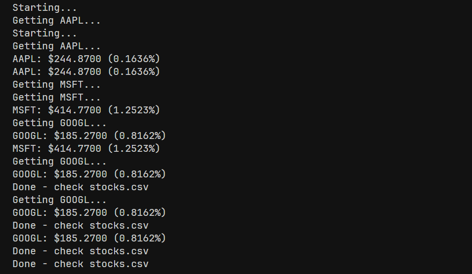

# Stock Price Scraper

A simple Go program that fetches real-time stock prices using the Alpha Vantage API.



## Features
- Fetches real-time stock data for AAPL, MSFT, and GOOGL
- Displays stock prices and change percentages in the console
- Saves data to a CSV file

## Setup
1. Get an API key from [Alpha Vantage](https://www.alphavantage.co/)
2. Create a `.env` file with:
```
ALPHA_VANTAGE_KEY=your_api_key_here
```

## Run
```bash
go run main.go
```

The program will create a `stocks.csv` file with the results.
